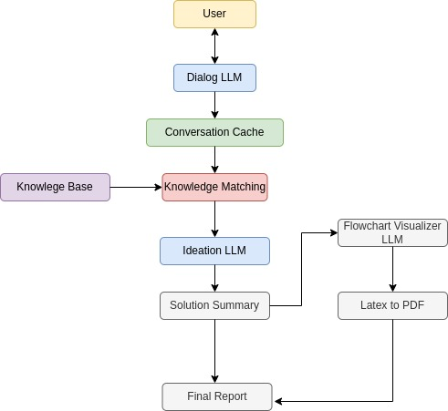

# Sokrates

Identifying valuable use cases for AI implementation in the industry is a complex and time-consuming process that often requires extensive domain expertise and resources. Many companies, especially in the German Mittelstand, are lacking the resources for AI consultancies and do not have access to relevant domain experts. Sokrates is a prototype of a conversational AI assistant that has been developed in order to democratize AI access for SMEs. 

This prototype was made during the TUM AI Makeathon held at the Technical University of Munich from April 28 - May 1 2023. 

## Design

The design contains the following modules: 

* **Dialog LLM :** This is a open ai gpt-3.5-turbo powered LLM which is responsible for holding a conversation with the user in order to gather further information about the issue at hand. We instruct it to  elicit knowledge from the user in a step-by-step manner.

*  **Conversation Cache :** This cache holds the full conversation history with the user in the current instance. The summary of that dialogue acts as key against our domain-specific database

* **Knowledge Base:** This can be a .csv file or a database which contains summaries of existing AI use case implementations in the industry of choice. In this project we have included 15 summaries of AI implementation in the automotive industry in a csv file. 

* **Knowledge Matching:** We have embeddings stored for every article. Given some query, we embed it too and return the top-k most similar articles based on cosine similarity

* **Ideation LLM:** This combines the top matches in the knowledge database and the gpt-3.5-turbo model to come up with a solution summary.

* **Flowchart Visualization LLM:** This module takes in the summary generated by the Ideation LLM and then converts it to solution steps which further is converted to a flowchart in a latex format. This generated image is then rendered into a PDF file. 
## Dependencies
## Setup
## Running the Project
## Contributors

* Andreas Binder - TU Munich
* Ayushman Choudhuri - RWTH Aachen
* Michał Cherczyński - TU Munich
* Ivana Dobrijevic - TU Munich
